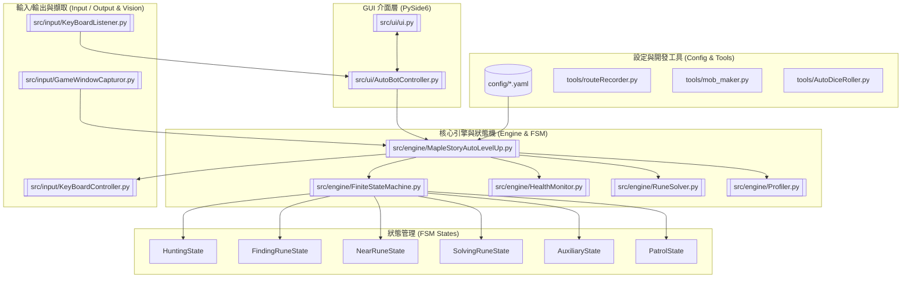
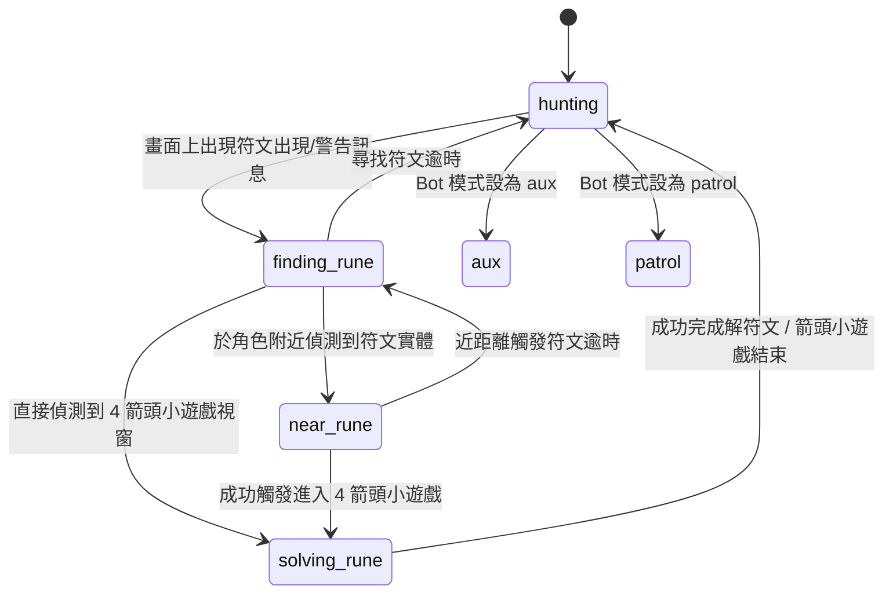

# 楓之谷 Artale 自動練等腳本專案架構與功能說明 (PROJECT_STRUCTURE.md)

本文件旨在提供 **MapleStoryAutoLevelUp** 專案的全面架構解析、模組劃分、狀態轉移邏輯、資料流管道以及開發維護指南，供開發者（Human）與 AI Assistant（Antigravity）共同閱讀與參考。

---

## 1. 專案概覽 (Project Overview)

本專案是一款專為 **MapleStory Artale (MapleStory Worlds)** 開發的自動練等機器人。
* **純電腦視覺 (Pure Computer Vision)**：不讀取或修改遊戲記憶體（Memory-free），透過畫面擷取（Screen Capture）與 OpenCV 圖像匹配技術取得角色位置、怪物與符文。
* **真實鍵盤模擬**：使用 `pyautogui` / `pynput` / Windows Capture API 進行無痕或視窗級別的鍵盤模擬與控制。
* **有限狀態機 (FSM)**：包含打怪打寶 (`hunting`)、尋找符文 (`finding_rune`)、靠近符文 (`near_rune`)、自動解符文箭頭 (`solving_rune`) 等多個狀態。
* **模組化設計**：包含 GUI 介面、核心引擎、獨立血量監控線程、地圖路徑錄製工具與創角擲骰工具。

---

## 2. 系統整體架構圖 (System Architecture)



---

## 3. 目錄結構與檔案對照 (Directory Hierarchy)

```text
MapleStoryAutoLevelUp/
├── src/                                   # 主程式原始碼
│   ├── main.py                            # GUI 啟動入口
│   ├── ui/                                # PySide6 介面與控制器
│   │   ├── ui.py                          # 主視窗與頁籤介面
│   │   └── AutoBotController.py           # GUI 與引擎溝通的中介橋樑
│   ├── engine/                            # 核心自動化邏輯與引擎
│   │   ├── MapleStoryAutoLevelUp.py       # Bot 主引擎 (擷取處理/定位/攻擊/導航)
│   │   ├── FiniteStateMachine.py          # 有限狀態機
│   │   ├── HealthMonitor.py               # 獨立喝水/強制回城線程
│   │   ├── RuneSolver.py                  # 符文偵測與 4 箭頭解密演算法
│   │   └── Profiler.py                    # 效能與 FPS 診斷工具
│   ├── states/                            # FSM 各狀態實作
│   │   ├── base_state.py                  # 狀態抽象基底類別
│   │   ├── hunting.py                     # 正常打怪巡邏狀態
│   │   ├── finding_rune.py                # 尋找地圖上的符文
│   │   ├── near_rune.py                   # 移動至符文旁並觸發
│   │   ├── solving_rune.py                # 解符文箭頭小遊戲
│   │   ├── auxiliary.py                   # 輔助/放 Buff 模式
│   │   └── patrol.py                      # 無地圖純來回巡邏模式
│   ├── input/                             # 視窗擷取與模擬控制
│   │   ├── GameWindowCapturor.py          # Windows Capture 視窗擷取線程
│   │   ├── GameWindowCapturorForMac.py     # macOS 視窗擷取線程
│   │   ├── KeyBoardController.py          # 按鍵模擬輸出線程 (pyautogui)
│   │   └── KeyBoardListener.py            # 熱鍵監控 (F1/F2/F3/F12)
│   ├── legacy/                            # 舊版程式碼歸檔 (以全螢幕截圖為主)
│   └── utils/                             # 通用函式庫與工具
│       ├── common.py                      # OpenCV 模板匹配/小地圖座標轉換
│       ├── global_var.py                  # 全域常數與解析度設定
│       ├── logger.py                      # 中央日誌系統
│       └── ui.py                          # 自訂 Qt 元件與 Log 處理器
├── config/                                # YAML 設定檔系統
│   ├── config_default.yaml                # 預設完整設定檔 (含詳細註解)
│   ├── config_data.yaml                   # 地圖與怪物映射、中英翻譯庫
│   ├── config_custom.yaml                 # 使用者自訂覆蓋設定檔
│   ├── config_cleric.yaml                 # 僧侶職業設定檔範例
│   └── config_macOS.yaml                  # macOS 專用設定覆蓋檔
├── tools/                                 # 獨立開發者工具
│   ├── routeRecorder.py                   # 地圖與路線錄製工具
│   ├── mob_maker.py                       # 怪物圖片自動下載器 (GMS API)
│   ├── AutoDiceRoller.py                  # 創角介面自動擲骰機器人
│   └── getPixeColorOnImg.py               # 圖像像素 RGB 取色器
├── minimaps/                              # 各地圖小地圖 (`map.png`) 與路線檔 (`route*.png`)
├── monster/                               # 各怪物圖片樣板 (`monster/{mob_name}/`)
├── nametag/                               # 角色名稱標籤樣板 (舊版定位)
├── misc/                                  # UI 按鈕與登入按鈕樣板
└── rune/                                  # 符文與箭頭樣板圖片
```

---

## 4. 核心模組與功能分析 (Module Breakdown)

### 4.1 GUI 與控制器層

* **[main.py](file:///mnt/c/Users/d0981/MapleStoryAutoLevelUp/src/main.py)**：GUI 程式進入點，初始化 `QApplication`、`AutoBotController` 與 `MainWindow`。
* **[ui.py](file:///mnt/c/Users/d0981/MapleStoryAutoLevelUp/src/ui/ui.py)**：PySide6 實現的主視窗。
  - **Main Tab**：設定打怪模式 (Basic / AOE)、攻擊範圍、按鍵綁定、喝水設定、地圖選擇與日誌輸出視窗。
  - **Advanced Settings Tab**：動態根據 YAML 設定檔生成各分組設定（如 Watchdog, Rune, Party Red Bar）。
  - **Game Window Viz / Route Map Viz Tab**：即時顯示影像處理畫面與路線地圖偵測點。
* **[AutoBotController.py](file:///mnt/c/Users/d0981/MapleStoryAutoLevelUp/src/ui/AutoBotController.py)**：解耦 GUI 與 Bot 引擎的中介控制器，管理背景線程啟動/暫停、熱鍵監控 (`KeyBoardListener`) 與 Qt Signal 轉發。

### 4.2 核心引擎與 FSM 狀態機

* **[MapleStoryAutoLevelUp.py](file:///mnt/c/Users/d0981/MapleStoryAutoLevelUp/src/engine/MapleStoryAutoLevelUp.py)**：Bot 的核心類別 `MapleStoryAutoBot`。
  - 整合 `GameWindowCapturor` 畫面擷取與 `KeyBoardController` 控制。
  - 透過 `get_player_location_by_party_red_bar()` 於遊戲畫面上定位角色隊伍血條。
  - 透過 `get_player_location_on_global_map()` 將小地圖玩家點位 (`loc_player_minimap`) 映射至全域路線圖 (`loc_player_global`)。
  - 根據路線顏色碼發送移動/跳躍/瞬移指令 (`update_cmd_by_route()`)。
  - 偵測週圍怪物發動攻擊 (`update_cmd_by_mob_detection()`)。
  - 卡住防護機制 (`is_player_stuck()` & Watchdog)。
* **[FiniteStateMachine.py](file:///mnt/c/Users/d0981/MapleStoryAutoLevelUp/src/engine/FiniteStateMachine.py)**：實現有限狀態機，控管目前運行的 State（如 `HuntingState`、`SolvingRuneState` 等）及狀態切換。

### 4.3 視覺定位與辨識演算法

1. **角色定位 (Player Localization)**：
   - 首選方法：**隊伍紅色血條 (Party Red Bar)**。在遊戲中組隊後，角色頭頂會出現紅色血條。透過 HSV 範圍過濾 (`lower_red` ~ `upper_red`) 加上幾何特徵篩選 (高度 5~7px, 寬度 1~50px) 快速找出血條座標。
   - 備選方法：**名字標籤 (Nametag Template Matching)**。針對 NameTag 進行垂直分割比對。
2. **全域地圖映射 (Global Map Mapping)**：
   - 擷取左上角小地圖 (`img_minimap`)，使用 `find_pattern_sqdiff` 與完整的 `map.png` 進行樣板匹配，計算出小地圖在全域圖中的偏移 `loc_minimap_global`。
   - 結合玩家在小地圖上的黃點座標 (`loc_player_minimap`)，推算出全域世界座標 `loc_player_global`。
3. **怪物偵測 (Monster Detection)**：
   - 支援 4 種模式：`color`（全彩）、`grayscale`（灰階）、`contour_only`（輪廓外框）與 `template_free`（黑色背景遮罩連通體）。
   - 可結合敵方綠色 HP Bar (`hp_bar_color`) 輔助驗證怪物位置。
4. **符文與箭頭解密 (Rune Solver)**：
   - **[RuneSolver.py](file:///mnt/c/Users/d0981/MapleStoryAutoLevelUp/src/engine/RuneSolver.py)**。
   - 當畫面上出現「請解開符文」訊息時，觸發 `finding_rune` 狀態。
   - 在角色週圍區塊匹配紫光符文樣板，定位符文座標後靠近並按 `Up` 鍵進入箭頭小遊戲。
   - 使用 HSV 色彩空間篩選高亮箭頭 (`arrow_highlight_low_hsv`)，結合 **霍夫圓形變換 (Hough Circles)** 標記箭頭位置，並與上下左右箭頭樣板進行範本比對，按相應按鍵解鎖。

### 4.4 鍵盤控制與輸入監控

* **[GameWindowCapturor.py](file:///mnt/c/Users/d0981/MapleStoryAutoLevelUp/src/input/GameWindowCapturor.py)**：使用 `windows_capture` 庫以獨立線程高效擷取特定視窗標題的遊戲畫面，並確保 FPS 限制。
* **[KeyBoardController.py](file:///mnt/c/Users/d0981/MapleStoryAutoLevelUp/src/input/KeyBoardController.py)**：獨立背景線程，維護方向鍵 (`cmd_left_right`, `cmd_up_down`) 與動作 (`cmd_action`) 狀態。定期檢查 Buff 技能冷卻時間自動施放 Buff。
* **[KeyBoardListener.py](file:///mnt/c/Users/d0981/MapleStoryAutoLevelUp/src/input/KeyBoardListener.py)**：全局熱鍵監聽 (`F1` 暫停/繼續、`F2` 截圖、`F3` 錄製、`F12` 結束)。

### 4.5 血量與魔力監控

* **[HealthMonitor.py](file:///mnt/c/Users/d0981/MapleStoryAutoLevelUp/src/engine/HealthMonitor.py)**：獨立線程監控 UI 區塊的 HP/MP 血條百分比。當百分比低於設定值時，透過 `KeyBoardController` 觸發喝水按鍵；若藥水用盡且啟用回城，可發送回城卷軸按鍵 (`return_home`)。

### 4.6 輔助工具鏈

* **[routeRecorder.py](file:///mnt/c/Users/d0981/MapleStoryAutoLevelUp/tools/routeRecorder.py)**：路徑錄製工具。玩家親自操作角色行走與跳躍，該工具即時根據小地圖掃描拼接出 `map.png` 並將按鍵動作繪製成顏色線段，輸出為 `route1.png`, `route2.png`。
* **[mob_maker.py](file:///mnt/c/Users/d0981/MapleStoryAutoLevelUp/tools/mob_maker.py)**：怪物圖庫下載器。輸入怪物英文名稱，從 GMS 65 API 自動下載透明背景的怪物圖檔並存入 `monster/{MonsterName}/`。
* **[AutoDiceRoller.py](file:///mnt/c/Users/d0981/MapleStoryAutoLevelUp/tools/AutoDiceRoller.py)**：自動骰點工具。在創角介面辨識 STR/DEX/INT/LUK 數字樣板，當達到指定屬性（如 `4,4,13,4`）時自動停止。

---

## 5. FSM 狀態轉移邏輯 (State Transitions)



---

## 6. 資料處理管線 (Data Processing Pipeline)

```text
1. 視窗擷取 (GameWindowCapturor)
   └─ Raw RGB Image (1296x759)
      │
2. 視覺定位 (MapleStoryAutoBot)
   ├─ Party Red Bar 偵測 ───> 畫面角色座標 (loc_player)
   └─ Minimap Template Matching ───> 全域地圖座標 (loc_player_global)
      │
3. FSM 狀態決策 (FiniteStateMachine)
   ├─ 檢查符文與小遊戲狀態 (RuneSolver)
   └─ 依據目前狀態 (Hunting / FindingRune / SolvingRune) 執行邏輯
      │
4. 行動規劃 (Route & Mob Detection)
   ├─ 讀取 loc_player_global 週圍 route*.png 像素色彩 ───> 移動/跳躍指令
   └─ 讀取 attack_range 內怪物 ───> 轉向與攻擊指令
      │
5. 鍵盤模擬 (KeyBoardController)
   └─ pyautogui / pynput 觸發實際按鍵 (Left, Right, Jump, Attack, Buff, Potion)
```

---

## 7. 路線顏色代碼規範 (Route Color Code Standard)

在 `route*.png` 路線圖中，特定 RGB 顏色代表特定的角色控制指令：

| RGB 色彩碼 | 16 進位 | 指令動作 (`move_x move_y action`) | 說明 |
| :--- | :--- | :--- | :--- |
| `255, 0, 0` | `#FF0000` | `left none none` | 向左移動 |
| `0, 0, 255` | `#0000FF` | `right none none` | 向右移動 |
| `255, 127, 0` | `#FF7F00` | `left none jump` | 向左跳躍 |
| `0, 255, 255` | `#00FFFF` | `right none jump` | 向右跳躍 |
| `127, 255, 0` | `#7FFF00` | `none down jump` | 下跳 (Down Jump) |
| `255, 0, 255` | `#FF00FF` | `none none jump` | 原地跳躍 |
| `0, 255, 127` | `#00FF7F` | `stop stop stop` | 停止移動 |
| `255, 255, 0` | `#FFFF00` | `none none goal` | 路線終點，切換至下張 `route*.png` |
| `255, 0, 127` | `#FF007F` | `none up teleport` | 向上瞬移 (Mage Teleport) |
| `127, 0, 255` | `#7F00FF` | `none down teleport` | 向下瞬移 |
| `0, 127, 0` | `#007F00` | `left none teleport` | 向左瞬移 |
| `139, 69, 19` | `#8B4513` | `right none teleport` | 向右瞬移 |
| `127, 127, 127` | `#7F7F7F` | `none up none` | 按住上鍵（如爬梯） |
| `255, 255, 127` | `#FFFF7F` | `none down none` | 按住下鍵 |

---

## 8. 開發者與 AI 協同維護指南 (Developer & Agent Guide)

### 8.1 常用執行指令

* **啟動 GUI 視窗（推薦）**：
  ```bash
  python -m src.main
  ```
* **CLI 無 GUI 模式啟動**：
  ```bash
  python -m src.engine.MapleStoryAutoLevelUp --cfg custom
  ```
* **錄製新地圖路線**：
  ```bash
  python -m tools.routeRecorder --new_map <map_folder_name>
  ```
* **下載新怪物圖片**：
  ```bash
  python tools/mob_maker.py
  ```
* **創角自動擲骰**：
  ```bash
  python -m tools.AutoDiceRoller --attribute 4,4,13,4
  ```

### 8.2 設定檔繼承邏輯
設定檔加載順序如下（後者覆蓋前者）：
1. [config_default.yaml](file:///mnt/c/Users/d0981/MapleStoryAutoLevelUp/config/config_default.yaml)（基礎預設值）
2. [config_macOS.yaml](file:///mnt/c/Users/d0981/MapleStoryAutoLevelUp/config/config_macOS.yaml)（僅在 macOS 環境下自動覆蓋）
3. [config_custom.yaml](file:///mnt/c/Users/d0981/MapleStoryAutoLevelUp/config/config_custom.yaml) 或使用者透過 GUI / CLI 載入的自訂 YAML。

### 8.3 擴充開發注意事項
1. **新增狀態 (New State)**：於 `src/states/` 新增檔案繼承 `State` 基類，並在 [MapleStoryAutoLevelUp.py](file:///mnt/c/Users/d0981/MapleStoryAutoLevelUp/src/engine/MapleStoryAutoLevelUp.py) 的 `__init__` 中使用 `self.fsm.add_state()` 與 `add_transition()` 註冊。
2. **新增地圖 (New Map)**：在 [config_data.yaml](file:///mnt/c/Users/d0981/MapleStoryAutoLevelUp/config/config_data.yaml) 登記地圖與怪物映射，並在 `minimaps/{map_name}/` 放入 `map.png` 與 `route*.png`。
3. **修改演算法**：優先保持 `KeyBoardController` 與 `HealthMonitor` 的獨立線程與 Lock 安全，避免在 UI 主線程上進行阻塞性演算法運算。
